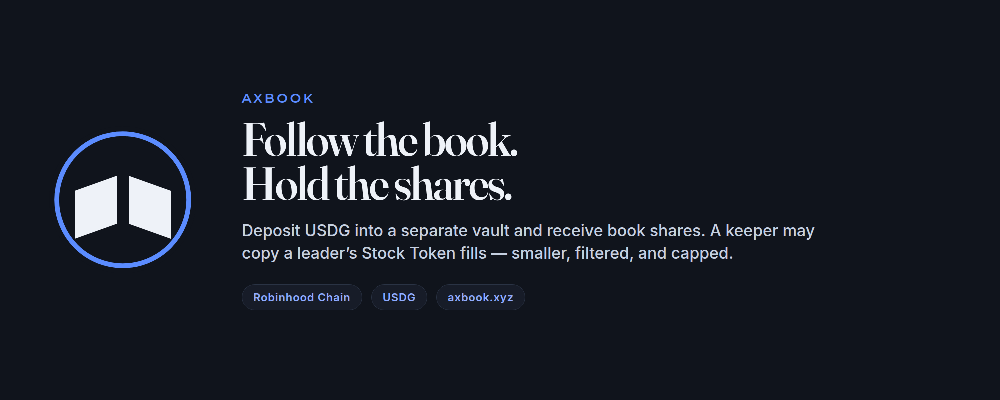

# Axbook



USDG desks that copy opted-in Stock Token traders on Robinhood Chain.

A leader trades from their own wallet. The key stays there. You deposit USDG into a separate vault and receive book shares: a pro-rata claim on that vault’s NAV, cash plus the positions the desk actually holds. A keeper may place a smaller copy of the leader’s fill. If the asset is not allowed, the session is closed, the price is stale, or the size breaks a limit, the desk skips. You leave by redeeming shares.

The desk can lose money. Copies are delayed, scaled, and capped, so a desk will not match the leader trade for trade.

Site: [axbook.xyz](https://axbook.xyz/) · Product: [app.axbook.xyz](https://app.axbook.xyz/) · Docs: [axbook.xyz/docs](https://axbook.xyz/docs)

Not affiliated with Robinhood Markets. Stock Tokens are not the same as directly owning shares.

## How a desk works

1. **Two piles.** The leader’s wallet is theirs. The vault is depositor capital.
2. **Book shares.** A deposit of USDG mints shares. Shares claim the desk’s NAV.
3. **A signal.** The keeper watches the leader’s fills and proposes a copy.
4. **Risk first.** Session size, then caps on each fill, each position, and gross exposure. A deep drawdown from the desk’s high-water NAV can stop new copies.
5. **Redeem.** If the vault has cash, it pays. If it does not, the claim waits in line.

Fees are a performance charge on profit above the previous peak NAV per share, plus a small AUM fee. There is no fee on volume. On Phase 2 desks the split is 70% leader / 20% protocol / 10% stakers. The leader can receive that fee share. The leader cannot withdraw the vault.

## Status

| Phase | What it is | Where it stands |
|---|---|---|
| Phase 0 | Paper copy. Every accept, resize, and skip is explainable. | Shipped. `make paper` |
| Phase 1 | Factory, cash vault, USDG deposit and redeem. | Shipped on Robinhood testnet `46630` |
| Capped mainnet | One desk, 50,000 USDG deposit cap. | Deploy is written. Broadcast stays behind `CONFIRM_MAINNET` |
| Phase 2 | Fixed-supply `$AXBOOK`, staking, stake-to-list, 12-month LP lock. | Code shipped. No token is deployed |
| Later | Buyback, vesting, bond slashing, ungated mainnet AUM. | Named only. No code |

`$AXBOOK`, when deployed, is an ERC-20 with a fixed supply of 1 billion, minted once, with no further mint. It is the listing bond (default 100,000 `$AXBOOK`), the asset staked for the 10% fee slice, and the token in a AXBOOK/USDG pool locked at least 365 days. It is not a claim on vault NAV, and it is not governance. Anything trading under an Axbook ticker today is not this repository.

## Chain

| | |
|---|---|
| Mainnet | `4663` — capped desk after a guarded deploy |
| Testnet | `46630` — Phase 1 cash vault, shipped |
| Gas | ETH |
| Accounting asset | USDG, 6 decimals |
| Books | Official Stock Tokens on `4663`, `verified` and `enabled` |

## Repository

| Path | Job |
|---|---|
| [`contracts/`](contracts/) | Desk factory, vault, risk, fees, swap adapter, `$AXBOOK` suite |
| [`keeper/`](keeper/) | Watches leader fills and submits vault copies |
| [`app/`](app/) | Blotter: deposit, redeem, shares, fill tape |
| [`sdk/`](sdk/) | Official token registry and NAV math |
| [`site/`](site/) | Project site and developer docs |
| [`docs/`](docs/) | Litepaper, runbooks, and risk |

| Contract | Responsibility |
|---|---|
| `DeskFactory.sol` | Creates one `DeskVault` per leader |
| `DeskVault.sol` | Holds USDG and allowlisted stock tokens, issues book shares |
| `RiskModule.sol` | Caps, session clock, drawdown halt, skip rules |
| `SwapAdapter.sol` | Restricted swap adapter |
| `FeeModule.sol` | High-water performance fee, AUM accrual, fee split |
| `SeatToken.sol` | Fixed 1B `$AXBOOK`, no mint after deploy |
| `StakingPool.sol` | Stake `$AXBOOK`, claim the USDG fee share |
| `LpLocker.sol` | Locks a Uniswap v3 position NFT for at least 12 months |
| `NavLib.sol` | USDG NAV from `balanceOfUI` and the oracle price |

## Quick start

```bash
git clone git@github.com:seat-hq/seat.git
cd seat
make install
make test
```

Paper copy, no private key:

```bash
make paper
```

Blotter (defaults to testnet `46630`):

```bash
make app-dev
```

Docs site, port 3100:

```bash
make site-dev
```

Keeper on testnet config. Execution stays on the paper path unless live guards pass:

```bash
make keeper-testnet
```

Phase 2 deploy does not run unless both confirms are set:

```bash
CONFIRM_MAINNET=I_UNDERSTAND CONFIRM_SEAT_TGE=I_UNDERSTAND make deploy-phase2
```

## Invariants

- `$AXBOOK` has no mint after the constructor.
- No fee on volume.
- NAV uses `balanceOfUI()`, not raw balances.
- After-hours size is smaller than cash-session size.
- Writes belong on `46630`, or on `4663` once a capped desk is wired.
- Mainnet deposits are capped at 50,000 USDG.

## Read next

- [Litepaper](docs/litepaper.md)
- [Phase 1 runbook](docs/phase-1.md)
- [Cited mainnet facts](docs/phase-1-live.md)
- [Phase 2 and `$AXBOOK`](docs/phase-2.md)
- [Mainnet day](docs/mainnet-day.md)
- [Risk](docs/risk.md)
- [Not affiliated](docs/not-affiliated.md)

Axbook is independent software. It is not affiliated with, endorsed by, or sponsored by Robinhood Markets. This repository is not investment advice. [MIT](LICENSE).
